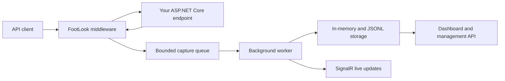

# FootLook documentation

FootLook is zero-interaction observability for ASP.NET Core APIs. It captures eligible HTTP requests and responses through middleware, then makes the resulting captures available for local inspection, operational metrics, and live updates.

Use FootLook when you need to investigate what an API is receiving and returning without adding logging calls to controllers, endpoints, or business services.

## In this documentation

- [What is FootLook?](#what-is-footlook)
- [Quickstart](#quickstart)
- [Configure capture](#configure-capture)
- [View live captures](#view-live-captures)
- [Use the management API](#use-the-management-api)
- [Protect sensitive data](#protect-sensitive-data)
- [Understand storage and reliability](#understand-storage-and-reliability)
- [Prepare for production](#prepare-for-production)
- [Troubleshoot FootLook](#troubleshoot-footlook)

## What is FootLook?

FootLook observes the ASP.NET Core request pipeline. For each eligible request, it records method, path, status code, elapsed duration, timestamp, correlation information, and optional request and response bodies. Capture processing happens in a background worker so the application can return its normal response without waiting for persistence.

FootLook includes the following capabilities:

- Capture request and response details without changing application endpoints.
- Limit capture by path, method, content type, body size, and sampling rate.
- Mask sensitive headers, query parameters, and body values.
- Propagate correlation and W3C trace context when available.
- Store captures in memory and append them to a JSONL file without requiring a database.
- Broadcast persisted captures to connected SignalR clients.
- Query capture history, statistics, privacy state, reliability state, and runtime status through management endpoints.

### How FootLook works



> [!IMPORTANT]
> FootLook's management endpoints do not have an authorization policy in the current demo implementation. Protect or restrict them before exposing an application outside a trusted environment.

## Quickstart

### Prerequisites

- .NET 8 SDK.
- An ASP.NET Core application using the minimal hosting model.
- Access to the `FootLook.Core` package or a project reference to the FootLook source project.

### Install the package

Add FootLook to the API project:

```bash
dotnet add package FootLook.Core
```

For a local solution, reference `FootLook.Core.csproj` from your web project instead.

### Add FootLook to the application

Add the required namespaces and register FootLook before building the application. Place `UseFootLook()` early in the middleware pipeline so it sees the full request lifecycle.

```csharp
using FootLook.Core.Extensions;
using FootLook.Core.Hubs;
using FootLook.Core.Options;

var builder = WebApplication.CreateBuilder(args);

builder.Services.AddFootLook(options =>
{
    builder.Configuration.GetSection("FootLook").Bind(options);
});

builder.Services.AddSignalR();

var app = builder.Build();

app.UseFootLook();

var footlookOptions = app.Services.GetRequiredService<FootLookOptions>();
app.MapFootLookEndpoints(footlookOptions);

app.MapHub<CaptureHub>("/footlook/live");

app.Run();
```

Send a request to any eligible application endpoint. FootLook queues the observation, persists it asynchronously, and exposes it through the configured endpoints and live hub.

## Configure capture

Configure FootLook under the `FootLook` section in `appsettings.json`.

```json
{
  "FootLook": {
    "Enabled": true,
    "SamplingRate": 1.0,
    "CaptureRequestBody": true,
    "CaptureResponseBody": true,
    "MaxBodyLength": 1048576,
    "EndpointBasePath": "/footlook",
    "QueCapacity": 10000,
    "ServiceName": "OrdersApi"
  }
}
```

### Common options

| Option                | Description                                                                     | Example      |
| --------------------- | ------------------------------------------------------------------------------- | ------------ |
| `Enabled`             | Enables or disables new captures.                                               | `true`       |
| `SamplingRate`        | Fraction of eligible requests to capture. Use a value from `0.0` through `1.0`. | `0.25`       |
| `CaptureRequestBody`  | Stores eligible request bodies.                                                 | `true`       |
| `CaptureResponseBody` | Stores eligible response bodies.                                                | `true`       |
| `MaxBodyLength`       | Maximum length retained for each captured body.                                 | `1048576`    |
| `EndpointBasePath`    | Route prefix for the management API.                                            | `/footlook`  |
| `QueCapacity`         | Capacity of FootLook's bounded asynchronous queue.                              | `10000`      |
| `ServiceName`         | Logical service name included with captures.                                    | `OrdersApi`  |
| `EnvironmentName`     | Environment label included with captures.                                       | `Production` |

### Exclude noise

Exclude endpoints that should not produce captures, especially the dashboard, management routes, health probes, Swagger, and static files.

```csharp
builder.Services.AddFootLook(options =>
{
    builder.Configuration.GetSection("FootLook").Bind(options);

    options.IgnoredPaths.Add("/footlook");
    options.IgnoredPaths.Add("/footlook.html");
    options.IgnoredPaths.Add("/swagger");
    options.IgnoredPaths.Add("/favicon.ico");
});
```

## View live captures

FootLook broadcasts each successfully persisted capture over the SignalR hub at `/footlook/live`. Clients receive the `captureReceived` event.

```javascript
const connection = new signalR.HubConnectionBuilder()
  .withUrl('/footlook/live')
  .withAutomaticReconnect()
  .build();

connection.on('captureReceived', (capture) => {
  console.log(`${capture.method} ${capture.path} ${capture.statusCode} ${capture.durationMs}ms`);
});

await connection.start();
```

For the included runtime dashboard, browse to `/footlook.html` after the host starts.

## Use the management API

`MapFootLookEndpoints` maps the management API beneath `EndpointBasePath`, which defaults to `/footlook`.

| Method   | Route                          | Use it to                                                 |
| -------- | ------------------------------ | --------------------------------------------------------- |
| `GET`    | `/footlook/health`             | Check the service, configured sinks, and capture state.   |
| `GET`    | `/footlook/captures`           | List filtered and paged captures.                         |
| `GET`    | `/footlook/captures/{id}`      | Retrieve a capture by ID.                                 |
| `GET`    | `/footlook/captures/stats`     | Retrieve aggregate request statistics and top endpoints.  |
| `GET`    | `/footlook/captures/recent`    | Retrieve recent captures.                                 |
| `GET`    | `/footlook/captures/history`   | Retrieve capture history from the in-memory store.        |
| `DELETE` | `/footlook/captures`           | Clear retained in-memory captures.                        |
| `POST`   | `/footlook/captures/pause`     | Pause new capture activity.                               |
| `POST`   | `/footlook/captures/resume`    | Resume capture activity.                                  |
| `GET`    | `/footlook/privacy/status`     | Inspect active privacy settings.                          |
| `GET`    | `/footlook/reliability/status` | Inspect queue, retry, and processing reliability metrics. |

> [!NOTE]
> The default management API reads the in-memory capture store. The JSONL sink persists captures to disk, but clearing captures removes only the in-memory records.

## Protect sensitive data

FootLook is intended to provide visibility without casually exposing sensitive API data. Review the following controls before enabling body capture in production:

- Mask sensitive request headers and query parameters.
- Mask sensitive JSON and form fields.
- Configure a body-size limit with `MaxBodyLength`.
- Disable request or response body capture where it is unnecessary.
- Exclude authentication, payment, administrative, and health-check paths through `IgnoredPaths`.
- Configure client IP and user-agent hashing with a protected `PrivacyHashSalt` where required.

Do not place secrets, connection strings, tokens, or privacy salts in source-controlled configuration files.

## Understand storage and reliability

FootLook uses a bounded queue between the request pipeline and persistence. The background worker handles deduplication, retries failed writes with exponential backoff, writes to configured sinks, publishes in-process events, and sends the live SignalR notification.

By default, the active capture path uses:

- **In-memory storage** for fast capture inspection, history, and statistics.
- **JSONL file storage** for append-only local persistence.

No database is required. Under sustained queue pressure, the queue is configured to drop the oldest captured item. Choose a queue capacity and sampling rate appropriate for the traffic level and acceptable capture-loss risk.

## Prepare for production

Before deploying FootLook to a production environment:

1. Add authorization to all management endpoints and the SignalR hub.
2. Review body capture, redaction, client metadata hashing, and retention settings with your security requirements.
3. Exclude dashboards, probes, static paths, and other known noise sources.
4. Set `ServiceName` and `EnvironmentName` to values that make captures identifiable across deployments.
5. Monitor `/footlook/reliability/status` and `/footlook/operations/health` for queue pressure, retries, and failed persistence.
6. Validate storage capacity, JSONL rotation, and retention behavior for the host filesystem.

## Troubleshoot FootLook

### Requests do not appear

Check that `Enabled` is `true`, `UseFootLook()` is registered, and the requested path is not ignored. Also confirm that the request matches any configured method, content, and sampling rules.

### The dashboard does not update live

Confirm that SignalR is registered with `AddSignalR()`, that `CaptureHub` is mapped at `/footlook/live`, and that the client listens for `captureReceived`. A capture is broadcast only after it has been persisted successfully.

### Captures are missing during heavy traffic

Inspect `/footlook/reliability/status`. The queue is bounded and can discard older captures under pressure. Increase `QueCapacity`, reduce `SamplingRate`, or reduce captured body volume based on your throughput requirements.

### The management routes are not available

Confirm that `MapFootLookEndpoints(footlookOptions)` runs after building the application and that the route uses the configured `EndpointBasePath`.

## Next steps

- Use [the FootLook product overview](../README.md) to understand the companion website project.
- Review the source implementation for advanced operational, privacy, and outcome endpoints.
